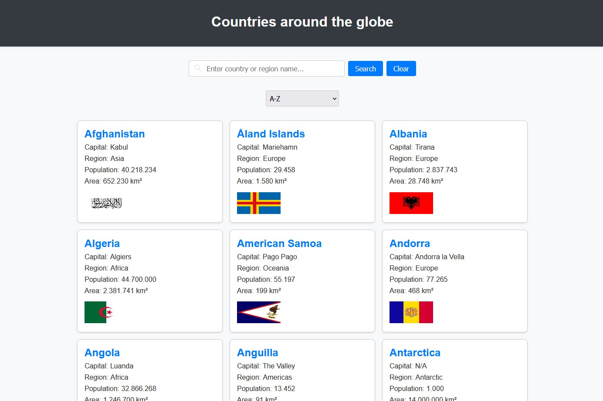

# Countries Around the Globe

This project provides a comprehensive overview of countries worldwide, offering details such as region, territory and population. It features filtering and sorting capabilities to enhance user exploration.

<div align="center">
  
</div>

## Live Demo

Check out the live demo: [Countries Around the Globe](https://alexsanderme.github.io/countries_info-web/).

## Features

- Detailed country information including:
  - Capital city
  - Region
  - Population
  - Area (in km²)
  - National flag
- Search functionality to find specific countries or regions
- Sorting options:
  - Alphabetical (A-Z)
  - By territory size
  - By population
- Clean and intuitive user interface

## Project Structure

```
countries_info-web
├── index.html
├── scripts/
│   └── app.js
├── styles/
│   └── styles.css
└── screenshots/
    └── interface.jpg
```

## Usage

1. Visit [here](https://alexsanderme.github.io/countries_info-web/) or open `index.html` in your web browser.
2. Use the search bar to find specific countries or regions.
3. Select sorting options from the dropdown menu to organize the data.

## Technologies Used

- HTML5
- CSS
- JavaScript

## License

This project is open source and available under the [MIT License](LICENSE).
